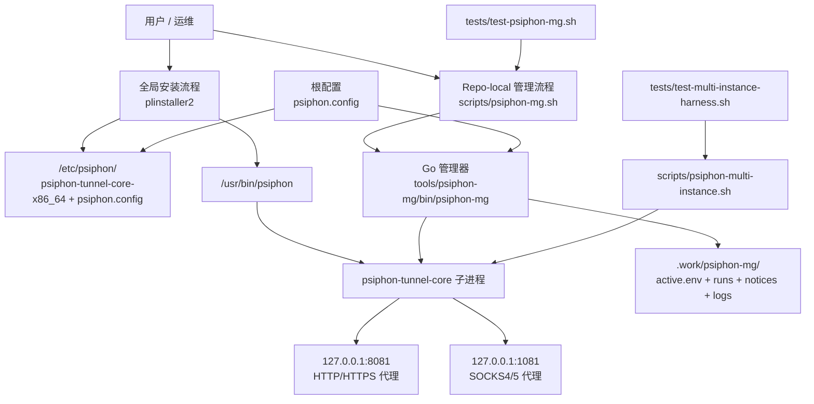

# Linphon

Linphon 是一个面向 Linux 的 Psiphon 封装项目，目标是把 **全局安装使用** 和 **仓库内单地区管理/测试** 两条路径整理清楚，同时尽量保留原有命令入口的兼容性。

> 当前仓库已经完成品牌改名为 **Linphon**，但为了兼容旧使用方式，`psiphon`、`plinstaller2`、`pluninstaller` 等入口名暂时保持不变。

## 项目提供什么

- 一个兼容保留的 **全局安装入口**：`plinstaller2` / `pluninstaller` 入口名仍然存在，但自动远程下载安装已禁用，需改用人工审核的本地制品流程
- 一个仓库内的 **repo-local 管理器**：通过 `bash scripts/psiphon-mg.sh` 做 `start / switch / stop / status / current-region`
- 一套 **离线可重复测试**：`tests/test-psiphon-mg.sh` 与 `tests/test-multi-instance-harness.sh`
- 一个保留中的 **archive 手动流程**：用于参考旧版手动目录安装方案

## 两种使用方式

### 1）全局入口（兼容保留，自动远程安装已禁用）

```bash
# plinstaller2 目前会直接失败关闭（exit 66），因为仓库还没有
# “下载后二进制真实性校验” 这一步。
```

如果你需要传统的全局安装方式，请改用**人工审核过的本地制品**，例如手动把以下文件放到目标位置：

- `archive/psiphon-tunnel-core-x86_64` -> `/etc/psiphon/psiphon-tunnel-core-x86_64`
- `psiphon.config` -> `/etc/psiphon/psiphon.config`
- `psiphon` -> `/usr/bin/psiphon`

之后再运行：

```bash
sudo psiphon
```

默认情况下：

- HTTP / HTTPS 代理：`127.0.0.1:8081`
- SOCKS4/5 代理：`127.0.0.1:1081`

如果要卸载：

`pluninstaller` 仍可用于删除显式安装目标（`/etc/psiphon` 与 `/usr/bin/psiphon`），但它不再删除当前工作目录下的相对路径文件。

### 2）仓库内管理（推荐给开发、切区测试、验证）

Linphon 现在还包含一个 repo-local 的地区管理器，适合在仓库目录内做：

- 单地区启动
- 地区切换
- 状态查看
- 自动化测试 / 验证

管理器公共入口保持为：

```bash
bash scripts/psiphon-mg.sh
```

它默认期望 Go 二进制位于：

```text
tools/psiphon-mg/bin/psiphon-mg
```

如果没有该二进制，也可以通过环境变量指定：

```bash
PSIPHON_MG_GO_BINARY=/path/to/psiphon-mg bash scripts/psiphon-mg.sh status
```

## 快速开始（repo-local 管理器）

### 构建 Go 管理器

```bash
mkdir -p tools/psiphon-mg/bin
(cd tools/psiphon-mg && go build -o ../../tools/psiphon-mg/bin/psiphon-mg ./cmd/psiphon-mg)
```

### 启动某个地区

```bash
bash scripts/psiphon-mg.sh start US \
  --binary ./archive/psiphon-tunnel-core-x86_64
```

### 切换地区

```bash
bash scripts/psiphon-mg.sh switch CA
```

### 停止

```bash
bash scripts/psiphon-mg.sh stop
```

### 查看状态

```bash
bash scripts/psiphon-mg.sh status
bash scripts/psiphon-mg.sh current-region
```

## 架构图

下面这张图描述了 Linphon 当前的两条主路径：



## 核心目录结构

- **仓库根目录**：兼容性的公共 shell 入口与主配置
  - `plinstaller2`
  - `pluninstaller`
  - `psiphon`
  - `psiphon.config`
  - `README.md`
- **`archive/`**：旧的手动安装流与归档兼容文件
- **`scripts/`**：仓库内可执行入口和辅助脚本
  - `scripts/psiphon-mg.sh`
  - `scripts/psiphon-multi-instance.sh`
  - `scripts/run-psiphon-staged.sh`
- **`tests/`**：shell 黑盒测试与 fake tunnel-core
- **`tools/psiphon-mg/`**：Go 版管理器源码
- **`.work/`**：运行时/测试产物目录，属于临时状态，可安全删除

## 配置文件 `psiphon.config` 里最重要的字段

通常真正会改的只有这几个：

- `LocalHttpProxyPort`：本地 HTTP/HTTPS 代理端口
- `LocalSocksProxyPort`：本地 SOCKS 代理端口
- `EgressRegion`：目标出口地区，例如 `US`、`CA`、`JP`

其他字段（如 `PropagationChannelId`、`SponsorId`、`RemoteServerListUrl`、`RemoteServerListSignaturePublicKey`、`UseIndistinguishableTLS`）更像是 Psiphon 的分发、引导、校验或策略字段，**不要随意改**。

对于多实例/多地区运行场景，还需要额外关注：

- `RemoteServerListDownloadFilename`

它在单实例时通常可以保持固定；但在同机多实例或共享数据目录场景下，应当做隔离，避免多个实例写同一份缓存/续传状态。

## 管理器行为边界

当前 Go 管理器的定位是：

- 一次只管理 **一个 active region**
- 通过 **外部 stop/start** 切换地区，而不是热重载
- 使用最新 `Tunnels.count > 0` 作为 tunnel-ready 判定
- `status` 输出的是进程状态和 notices 派生信号，**不自动等价于完整端到端网络可用性证明**

另外，出于安全考虑，Go 管理器目前 **拒绝** `--download-if-missing` / `--download-url`，不会自动下载并执行未经验证的 tunnel-core 二进制。请显式提供：

```bash
--binary ./archive/psiphon-tunnel-core-x86_64
```

## 常见问题

### 浏览器怎么接代理？

浏览器代理设置里填：

- HTTP / HTTPS：`127.0.0.1:8081`
- SOCKS：`127.0.0.1:1081`

然后访问 IP 检测网站确认出口是否已经变化。

### 怎么切换地区？

如果你使用 repo-local 管理器：

```bash
bash scripts/psiphon-mg.sh start US
bash scripts/psiphon-mg.sh switch JP
```

如果你使用的是人工部署的全局/手动流程，则修改 `psiphon.config` 里的：

```json
"EgressRegion": "US"
```

人工安装后该文件通常位于：

```text
/etc/psiphon/psiphon.config
```

### archive 目录还有用吗？

有，但它属于**旧流程/兼容保留**。如果你只是普通使用或开发当前 manager，请优先看主 README 和 `scripts/psiphon-mg.sh`。

## archive 说明

旧版手动流程文档在：

```text
archive/README.md
```

如果你必须沿用旧手动安装法，请参考该文档；但主线推荐仍然是：

- 普通使用：人工审核的本地制品 + `psiphon`
- 仓库内开发和切区测试：`scripts/psiphon-mg.sh`

## 项目状态说明

Linphon 当前是一个**兼容优先**的演进型仓库：

- 公共 shell 命令入口尽量不破坏
- repo-local manager 正在向 Go 实现收敛
- 测试和文档优先服务于“可验证、可切区、可回归”

后续如果要继续深入，一般有两条路线：

1. 继续整理 `tools/psiphon-mg/` 的源码层次和测试覆盖
2. 进入发布前收口，例如提交、发布说明、长期稳定性回归
